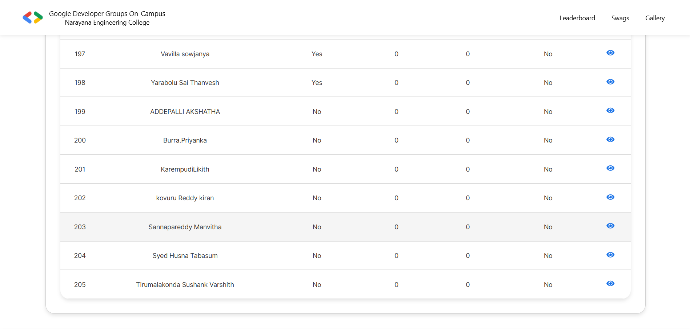
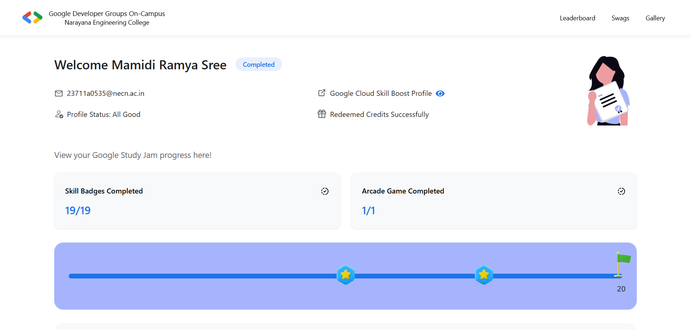
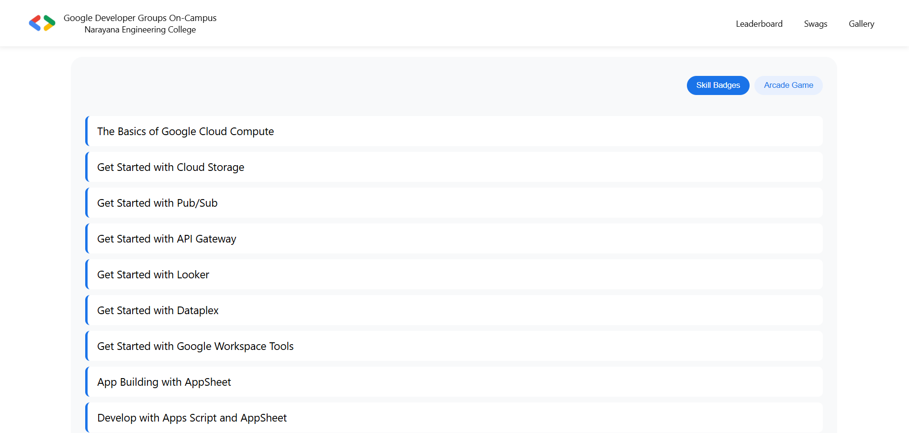

#  Study Jams Leaderboard

A full-stack leaderboard platform built for Google Study Jam 2025, designed to track and showcase the progress of every participating student.
The leaderboard displays live rankings, completion status, skill badges, arcade game achievements, and eligibility for swags.
Each student also gets a public portfolio page with a unique shareable URL - useful for LinkedIn, resumes, and certificates of participation.

The project supports **two modes**:

| Mode | Description |
|-------|-------------|
| **API Mode** | Fetches live leaderboard data from backend (Node.js + Express, hosted on Render). |
| **Static Mode (Default)** | Uses local JSON data (faster). |

> Render free tier sleeps after inactivity, causing 60-120s cold start delay.  
> To keep the project user-friendly, **API fetch is commented**, but fully functional and can be re-enabled anytime.

---

## Features

- Displays leaderboard of all participating students  
- Search by name with real-time filtering  
- Individual student profile page (`/studentDetails/:id`)  
- Shows skill badges, arcade games, redemption and completion status  
- Swag + Gallery: Students can see photos of last year’s swag distribution and event
  highlights. This year’s gallery will be added after the 2025 Success Meet.
- Fully responsive (mobile + desktop)  
- Elegant UI using Styled Components  
- API mode & static mode switch (developer-friendly)  
- Unique shareable link for each student to showcase progress in API Mode

---

## Live Links

| Resource | Link |
|----------|------|
| **Frontend (Live Demo)** | https://leaderboard-6dkp.onrender.com |
| **Backend API (Render)** | https://leaderboard-backend-423o.onrender.com |
| **Example Profile Page** | https://leaderboard-6dkp.onrender.com/studentDetails/62 *(works when API mode is enabled)* |

---


##  Tech Stack

| Layer | Technology |
|-------|------------|
| **Frontend** | React.js, React Router, Styled Components |
| **Backend (optional)** | Node.js + Express |
| **Deployment** | Render (Backend and Frontend)) |
| **Icons** | `react-icons` |
| **Loader** | `react-loader-spinner` |

---


## Screenshots

| Home Page | Student Details |
|-----------|-----------------|
|   |   |

---

## API Endpoints (Backend Mode)

| Method | Endpoint | Description |
|--------|----------|-------------|
| `GET` | `/students` | Returns full leaderboard |
| `GET` | `/students/:id` | Returns profile details of one student |

---

##  Setup & Installation

### Clone Repo

```bash
git clone https://github.com/your-username/study-jams-leaderboard.git
cd study-jams-leaderboard
```

### Frontend Setup (React)

```bash
cd leaderboard-frontend
npm install
npm start
```

### To switch Static Mode → API Mode:
```bash
Uncomment the API fetch code inside Leaderboard.jsx and StudentDetails.jsx.
```

### Backend Setup (Optional for Static Mode)
```bash
cd leaderboard-backend
npm install
node server.js
```

## Deployment Notes

1. Frontend can be deployed on Render 
2. Backend is deployed on Render (free tier)
3. static mode added to avoid cold start delay of Render backend

## Author & Credits

Built by: Ramya Sree Mamidi \
GDG On-Campus Web/App Dev Lead
